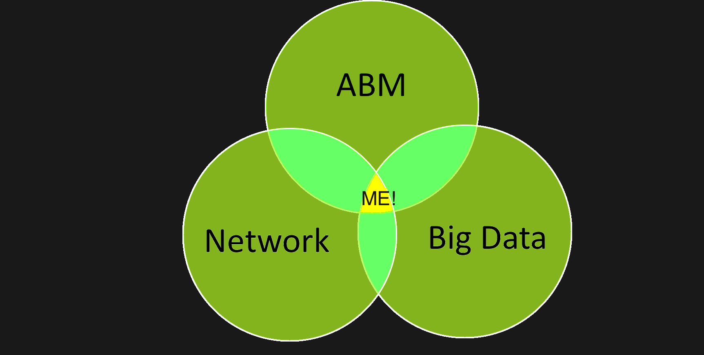

# About Me

_"There is only one to avoid criticism: Do nothing, say nothing, and be nothing"_ - Aristotle 

I am a Computational Social Science Ph.D. student in the [Department of Computational and Data Sciences](https://cos.gmu.edu/cds/academic-programs/) at George Mason University. Matthew was awarded the prestigious George Mason University, four-year Presidential scholarship. 

Matthew’s main research focus is applying computational social science to financial markets and understanding the drivers of innovations. This research has produced two forthcoming publications relating to influence of investor networks on the behavior of stock markets. Beyond this, Matthew has used an agent-based model to explore the strategies used in the Battle of Britain and is looking to explore the application of agent-based modeling to sports analytics.

 

Advisor: [Professor Axtell](http://www.css.gmu.edu/~axtell/Rob/Home.html)

# Background

He graduated from the University of Tasmania with a Bachelors of Economics with honors in 1995 and received his Chartered Financial Analyst designation in 2012. Prior to joining the Ph.D. program Matthew earned a Masters of Arts in Interdisciplinary Studies with a concentration in Computational Social Science at George Mason, following a career as a buy-side equities analyst in Australia.

# Header 1
## Education
### Header 3

- Bulleted
- List

1. Numbered
2. List

**Bold** and _Italic_ and `Code` text

