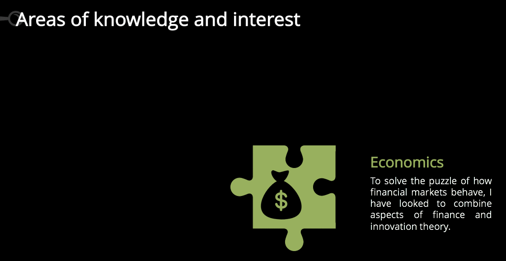

# About me

_"There is only one to avoid criticism: Do nothing, say nothing, and be nothing"_ - Aristotle 

I am currently a Computational Social Science (CSS) Ph.D. student in the <a href="https://cos.gmu.edu/cds/academic-programs/" target="blank">Department of Computational and Data Sciences</a> at George Mason University. My advisor, <a href="http://www.css.gmu.edu/~axtell/Rob/Home.html" target="blank">Professor Axtell</a>, is a leading expert in agent-based modelling (ABM), and most other things as well. My original intention was to only complete my masters in CSS but as things turned out I am doing my Ph.D.. Being awarded a prestigious George Mason University Presidential scholarship is certainly a great help, and has provided me extensive freedom to research and explore a variety of topics as I progress through the Ph.D. program. 

My research is focused on applying CSS for the purpose of gaining a greater understanding of how financial markets behave and to explore the dynamics driving innovation. To achieve my research goals, I have positioned myself at the intersection of ABM, network analysis, and big data/data science. This has meant that I have had to get up to speed on all the latest computation techniques.

Thus far my research has produced two publications relating to the influence of investor networks on the behavior of stock markets, and another on innovation. These papers can be found on my publications page, while my economics and finance pages provide a detailed summary of my work and the justification for it. Beyond this I have implemented an ABM to explore the strategies used in the Battle of Britain, and have pioneered the use of ABMs for use in sports analytics.

# Background
If you are not that interested in reading the details here, you can check-out <a href="Paper/MAO_CV.pdf" target="blank">my resume</a>, or my <a href="https://www.linkedin.com/in/oldhamma" target="blank">Linkedin</a> profile.

### Personal background
I was born on the great island of Tasmania, which sits to the south of mainland Australia. Most people think not a lot happens in Tasmania but it was a great place to grow up. I made the big move to the mainland, where I lived in Melbourne following the completion of my initial tertiary studies. My family and I then made the big move to Fairfax, Virginia, in 2014 where I started my current studies.

### Education
My academic career originally commenced in Tasmania, where I attended the University of Tasmania and was awarded a Bachelors of Economics with honors in 1995. My honors thesis, following Schumpeter’s “creative destruction,” investigated the relationship between market concentration and research and development (R&D) spending in Australia.

I then put myself through the <a href="https://www.cfainstitute.org/programs/cfaprogram/Pages/index.aspx" target="blank">Chartered Financial Analyst program</a>, earning my charter designation in 2012. However, my desire to continue learning and to gain greater insights in CAS prompted me to enroll in the Masters of Arts in Interdisciplinary Studies with a concentration in CSS at George Mason in 2014. I was subsequently awarded that degree in 2016.

### Work experience
In between my studies I have had an exciting and varied professional career. After university, I started work at Toyota Australia, and undertook numerous tasks including:

- Developing internal management information system (MIS), including pioneering forecasting;
- Working on the SAP R3 implementation team; and
- Performing various market analysis and forecasting function.

I then moved onto Ford Performance Vehicles where I helped run the sales and production planning processes.

A career change beckoned, and I made the switch to finance when I joined Equity Trustees in 2006. Initially my work involved strategic planning and merger and acquisitions work. I was then lucky enough to join the equities team, where I was a buy-side analyst for a number of years. It was during this period when, searching for greater insights to help inform superior investment decisions, that I came across the field of complexity, and as they say the rest in history.

### Eduation summary

- Computational Social Science PhD Program (Presidential Scholar)

GEORGE MASON UNIVERSITY | Fairfax, VA |Expected Completion December 2018

- Master of Arts in Computational Social Science 

GEORGE MASON UNIVERSITY | Fairfax, VA | 2016

- Bachelor in Economics with honors

UNIVERSITY OF TASMANIA| Hobart TAS, Australia | 1995

- Chartered Financial Analyst, 

CFA INSTITUTE | 2012 

### Work summary

- Investment Analyst | Equity Trustees Limited, Melbourne, Australia | 2008 to 2014

- Corporate Development Analyst | Equity Trustees Limited, Melbourne, Australia | 2006 to 2008

- Ford Performance Vehicles | Melbourne, Australia | 2003 to 2006

- Toyota Motor Corporation Australia Limited | Melbourne, Australia | 1996 to 2003

<!-- Start of SimpleHitCounter Code -->

 <a href="http://www.simplehitcounter.com" target="_blank" style="text-decoration:none;">web counter</a>

<!-- End of SimpleHitCounter Code -->

