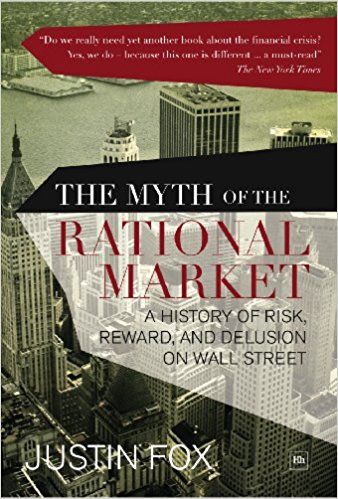
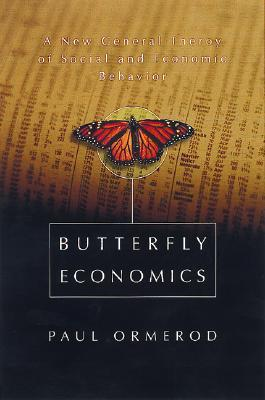
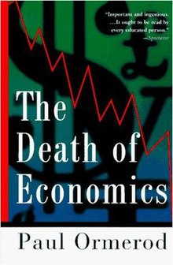

## Welcome to Economics and Finance Reading Reviews

Below are the books that have been instrumental in guiding my thought process in terms of viewing finance and economics through a complex adaptive system (CAS) lense. The books are either a direct reference to a CAS or argue successfully that the neo-classical paradigm is flawed.

some text with a link <a href="http://www.google.com" target="blank">google</a>

## The Origin of Wealth

This book is a great starting point in understanding the importance of considering the economy as a CAS. Beinhocker outlines how physical technologies, social technologies, and business designs continuously interact to create novel products, new ideas, and increasing wealth. In doing this he provides a rich history of economics, and where it has managed to fall short. Along the way you are introduced to many of the people and concepts outlined on my website. The only negative is the last chapter or so where the book digresses from “pure economic” concepts.

## Complexity and the Econonmy

Unlike popularized books, such as Mis(behaving) and Superforecasting, this book is more or less a collection of Brian Arthur’s life’s work. The downside being it is a “slightly” heavier read but the upside is that you are exposed to the evolution of complexity economics. Therefore, it may be best to start with Origins or the Death of Economics before reading this book.

The basis of all the papers are that the economy is always in process, always changing and people try to make sense of the situations they face using whatever reasoning they have at hand, and together create outcomes they must individually. This contrasted to the standard view where people are assumed to face well-defined problems and use perfect deductive reasoning to base their actions on. The paper cover topics as disparate as how markets form out of beliefs; how technology evolves over the long span of time; why systems and bureaucracies get more complicated as they evolve; and how financial crises can be foreseen and prevented in the future.

## An Engine not a Camera
{: width="350px"}.

The title comes from MacKenzie paraphrasing Milton Friedman in saying that economic models are an engine of inquiry rather than a camera to reproduce empirical facts. This theme is explored through how the emergence of modern economic theories of finance affected financial markets in fundamental ways, that is many of the theories became intrinsic parts of economic processes. The ramifications are illustrated by the role of portfolio insurance in the stock market crash of 1987, and the market turmoil that engulfed the hedge fund Long-Term Capital Management in 1998. 

The book also provides a great history of how the various theories became established. Additionally, the readers are exposed to some of concepts that relate to financial markets being a complex system.

## The Myth of the Rational Market

GDiuqgwefi

## Misbehaving

GDiuqgwefi

## Forecast

GDiuqgwefi

## The Mis(behavior) of Markets

GDiuqgwefi

## Superforecasting
{: width="350px"}.

GDiuqgwefi

## Why Stock Markets Crash 

Sornette is 

## The First Crash

GDiuqgwefi

## Butterfly Economics
{: width="350px"}.

## The Death of Economics
{: width="350px"}.
