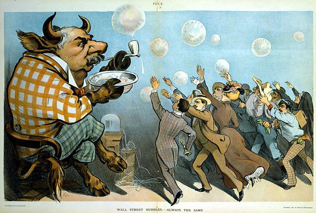
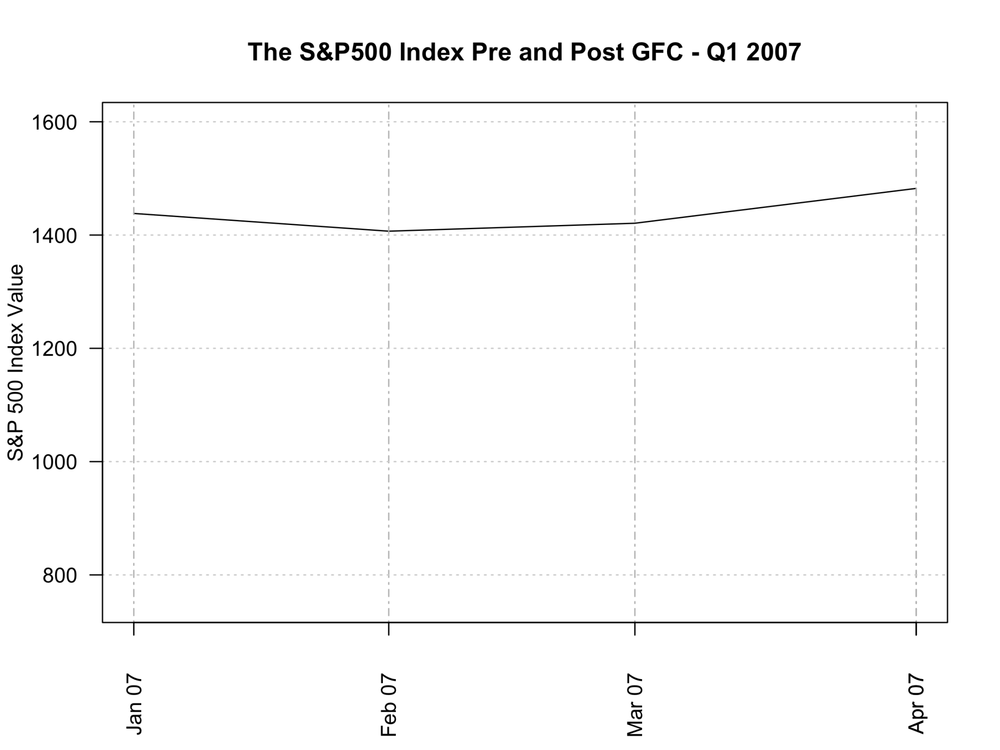
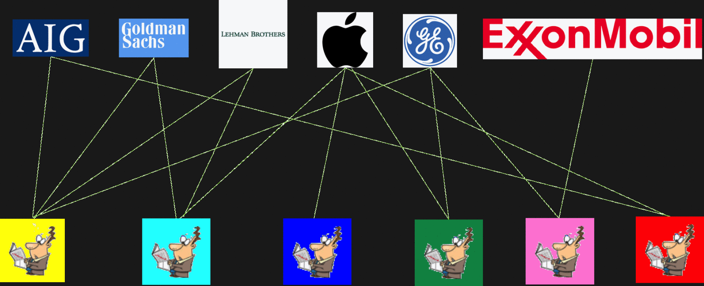

# Finance

_"You can have your own opinions. But you can't have your own facts"_ - Ricky Gervais

The behavior of financial market has frustrated, and continues to frustrate, investor and academics. The main bone of contention for me is that the Efficient Market Hypothesis (EMH) still underlies much of today's maianstrea theory and practices. Despite some empirical support for the EMH, and the models that utilize its assumptions, the reality of continued episodes of extreme volatility, booms, and crashes has led some to consider alternatives. The search for alternatives has gained further impetus following the crash in global markets in 2007, with considering financial markets as a complex adaptive system (CAS) proving to be a credible alternative.

A truer respresentation of the return characteristics of financial markets, as summarized by [Cont (2007)](papers/Cont 2007.pdf) and [Johnson, Jefferies, & Hui (2003)](https://www.amazon.com/Financial-Market-Complexity-Behaviour-Economics/dp/0198526652), is that they demonstrate: excess volatility – the existence of large movements not supported by the arrival of new news; heavy tails – returns exhibit “heavy tails” or “fat tails” indicating returns deviate more than anticipated and do not follow a Gaussian distribution; volatility clustering – large changes are followed by further large changes; and volume/volatility clustering – trading volumes and volatility show the same type of long memory. In addition, [Mandelbrot (1963)](papers/Mand1963.pdf) first provided evidence that returns may follow a very unique distribution, a  power law distribution, with [Lux and Alfarano (2016)](papers/LuxAlf2016.pdf) providing a detailed review of the empirical evidence supporting the existence of power laws in financial markets. For investors, the main implication of returns following a power law is that the risk of large losses is much higher than suggested by the EMH, and markets are more volatile. It is the existence of power law returns that provides the key insight that financial markets may operate as a complex system.

According to Johnson, Jefferies and Hui (2003), for a system to be considered complex, it must contain some, if not all, of the following: feedback, non-stationarity, many interacting agents, adaption, evolution, single realization, and it must be an open system. This position is consistent with the views of [Sornette (2014)](papers/Sornette2014.pdf), who concluded that to understand stock market returns, one must consider: imitation, herding, self-organized co-operativity, and positive feedbacks. [Farmer et al., (2012)](papers/Farmer2012.pdf) concluded that if one considers financial markets as a complex system, then one must accept that their outcomes are the result of an emergent process based on the self-organized behavior of independently acting, self-motivated individuals.

### The S&P 500 2007 - 2010

The above animation plots the course of the S&P 500 as it heads towards, and then recovers from the Global Financial Crisis (GFC). As mentioned above it was this "unexpected" and "unexplained" collapse that has provided the impetus for the search for alternative analytical frameworks. In my [journal articles](https://moldham74.github.io/AussieCAS/pub.html), I have implemented and report on an ABM that was capable of explaining why a market main behavior in such a manner. The key aspect aspect of the model being the ability of investors to consider the actions of their neighbors, thus point to another important field of research - network science.

### Markets and Networks
Network science   --- explaining in CAS. While the actual network configuration of investors may be all but impossible to uncover, a more obvious network is the one formed between investors and companies. This is know as a bipartite network and an example of how the network might behave is illustrated below. Links in the network are formed (removed) when an investor makes an investment (divestment) in a company. There are many implications stemming from the dynamics involved in trading, including how investors are linked by similar holdings

In my class project for CSS697 - Social Network Analysis, I managed to analysis the actual company x investor network for the S&P 500 and US instutional investors from 2007 to 2010. My findings can be found [here](papers/The quest for living beta.pdf). I presented the [findings](Presentations/NetSci2017.pptx) from the project at 2nd Workshop on Statistical Physics of Financial and Economic Networks satellie of the [NetSci2017](http://netsci2017.net/program/satellites) conference. 

The key finding of the paper was that the density of the market moved in-line withe the index. The changes is the density can be seen in the diagram below, which shows how density of the company x investor network changed through time. An increasing density, being represented by a "darker" graph, and vice versa for a decline in density.

I also found this great webpage over at the [Visual Capitalist](http://www.visualcapitalist.com) which covers complexity in financial markets.

Courtesy of: <a href="http://www.visualcapitalist.com">Visual Capitalist</a>

### References
Cont, R. (2007). Volatility Clustering in Financial Markets: Empirical Facts and Agent-Based Models. _In Long Memory in Economics (pp. 289–309)_. Springer Berlin Heidelberg. [https://doi.org/10.1007/978-3-540-34625-8_10](https://doi.org/10.1007/978-3-540-34625-8_10)

Farmer, J. D., Gallegati, M., Hommes, C., Kirman, A., Ormerod, P., Cincotti, S., … Helbing, D. (2012). A complex systems approach to constructing better models for managing financial markets and the economy. _The European Physical Journal Special Topics, 214_(1), 295–324. [https://doi.org/10.1140/epjst/e2012-01696-9](https://doi.org/10.1140/epjst/e2012-01696-9)

Friedman, M. (1953). _The Methodology of Positive Economics. In Essays in positive economics (Vol. 3)_. Chicago, Ill.: University of Chicago Press.

Johnson, N. F., Jefferies, P., & Hui, P. M. (2003). Financial Market Complexity. Oxford ; New York: Oxford University Press.

Lux, T., & Alfarano, S. (2016). Financial Power Laws: Empirical Evidence, Models, and Mechanisms. _Chaos, Solitons & Fractals, 88_, 3–18. [https://doi.org/10.1016/j.chaos.2016.01.020](https://doi.org/10.1016/j.chaos.2016.01.020)

Mandelbrot, B. (1963). The Variation of Certain Speculative Prices. _The Journal of Business, 36_(4), 394. [https://doi.org/10.1086/294632](https://doi.org/10.1086/294632)

Sornette, D. (2014). Physics and financial economics (1776–2014): puzzles, Ising and agent-based models. _Reports on Progress in Physics, 77_(6), 62001. [https://doi.org/10.1088/0034-4885/77/6/062001](https://doi.org/10.1088/0034-4885/77/6/062001)
