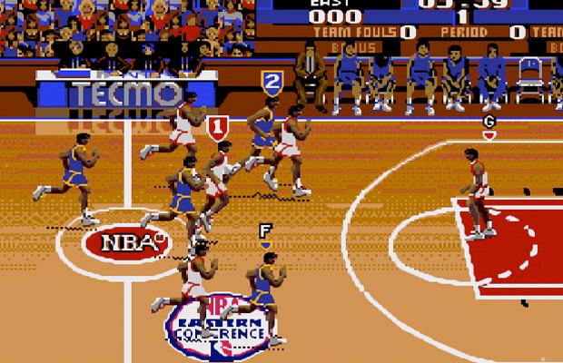

# Sports

_"You can't score a goal if you don't take a shot"_  - Johan Cruyff

Sports analytics (SA) has experienced a meteoritic rise in recent years, with the trend forecast to continue. <a href="http://www.marketwatch.com/story/sports-analytics-market-growing-at-379-cagr-to-2021-2016-05-09-2203123" target="blank">Modor Intelligence</a> reports that the market was valued at USD 83.56 million in 2015, and is forecast to grow to USD 447.23 million by 2020. However, the growth was a long time in the making as the genesis of SA can be traced back over 50 years. The delayed adaptation was partly due to the field being seen as frivolous and a hobby industry, and, as told in Moneyball, a reluctance of sporting organizations to include it in their decision-making.  However, this has now changed, with the only downside being that the innovative work is being carried out within the sports organizations with the work hidden from the public realm. However, this is changing given the massive amount of publicly available sporting data, and the field being taken seriously in the academic world.  

## Sports as a complex system

The consideration of sports being a complex adaptive system (CAS) is a newly established field of research. There have been a host of papers ([Clauset, Kogan, & Redner (2015)](papers/Clauset.pdf), [Gabel & Redner (2012)](papers/Gabel.pdf), [Martín-González, et al. (2016)](papers/Gon.pdf), [McGarry, Anderson, Wallace, Hughes, & Franks (2002)](papers/McGarry.pdf), and [Merritt & Clauset (2014)](papers/Merritt.pdf)), that have researched the topic. One of the key ramifications of the research, that comes from [Gabel and Redner (2012)](papers/Gabel.pdf), is that the scoring activity (lead changes, lead magnitude and the persistence of the lead) in a game of numerous sports follows a random-walk, with the exception being when a quarter comes to a close. At this point the distribution of the scoring activity becomes consistent with what would be predicted by a power-law.

If you do not want to read these papers, below is a presentation from Sidney Redner explaining his work with sports as a CAS. The actual presentation starts at the 4 minute mark.

<iframe width="650" height="365" src="https://www.youtube.com/embed/HfVi6NiKxIw" frameborder="0" gesture="media" allowfullscreen></iframe>

Given the billions of dollars invested globally in sporting franchises it may be somewhat disconcerting for fans to learn the game is a random walk. However, all is not lost because the outcome does not imply that skill has no role; rather, given relatively even skill levels at the highest level, this negates any systematic advantage, leaving the random walk (stochastic process) as the determining force. Another explanation for the random walk process is that players are short-term focused (behavior seen in financial markets), as they attempt to maximize their scoring while minimizing the immediate opportunities of their opponents. This means that there is little strategic play and players react to events as they occur. 

The random walk process also implies that teams cannot get “hot” -- i.e., record an extended streak of making their attempts. The paper of [Bar-Eli et al. (2006)](papers/Bar2006.pdf) is a great rundown on the “hot hand” debate. In summary, though, it is one of the great cognitive errors.

## My contributions

As I have progressed through my Ph.D. studies I have managed to undertake several projects relating to sports and complex systems. In addition, I completed the wonderful OR603 Sports Analytics course taught by <a href="http://espnmediazone.com/us/bios/brian-burke/" target="blank">Brian Burke</a> at George Mason.

## Completed works
### Increasing competitiveness in Formula One
Evidence of a power law points to the existence of a complex system – a system that exhibits feedback loops, hierarchical organization and some degree of spontaneous order. Traditional models are ineffective in analyzing how and why these systems operate. The distribution of success in Formula One matches that of a power law but the question remains: how and why? The obvious factors for success in Formula One are financial and human resources. Using an ABM the paper explores the likelihood that path dependence and increasing returns to scale are responsible for the presence of a power law in Formula One.

My paper can be found [here](papers/F1 Final Paper M Oldham.pdf).

## Works in the pipeline

### ABM meets NBA
To support the use of ABM in sports analytics, I created an ABM of a basketball game, where the fundamentals of play, including player and court positions, a shot clock, and shooting performance, are all included. Additionally, player behavior in deciding whether to shoot, pass or dribble is partially predicated on assessing the length of a player’s shooting streak (designed to test the hot-hand effect), and the consideration they give to any streak, plus their franchise status. The probabilistic nature of the model allows for insights into the dynamics of scoring actions following a random walk. The model captures extensive data which was used to calibrate and validate it against comparable statistics from the National Basketball Association (NBA).

To assess the implications of a team’s belief in their franchise player, and a hot-hand belief the ABM is utilized as a virtual laboratory. By varying certain variables, including the threshold required for a streak, and the bias towards favoring the team’s franchise player key insights are gained. The clear implications are that an increased belief in the franchise player leads to increased scoring action, with the franchise player taking a greater proportion of the shots, but a belief in the hot-hand has at best a minor effect. Results across other indicators such as lead changes and maximum leads showed that as a team’s belief in their franchise player increased it did not affect the outcome or the course of the game. This supports the hypothesis that in general play scoring activity indeed is a random walk, with only the distribution of scoring among players affected.

### Streaky golfers
For all but a few superstars of golf, the secret to consistently low scores remains an unsolved mystery, with most golfers guided by the heuristic “drive for show, putt for dough.” This paper adds to the discussion of identifying the determinants of golf performance by attempting to quantify the effects that tee-shots have on finishing inside the top 5, 10 of a US PGA Tour tournament. This is achieved by employing numerous classifications models on a dataset from the US PGA Tour that includes the strokes-gained and driving rank metrics.

The paper also investigates whether US PGA tour players exhibit “hot” or “cold” streaks from the tee. These streaks in general have become popularized as “hot” or “cold” hands, and relate to when a player has an identifiable run of performance above or below what is expected i.e., the player is “hot” or has gone “cold.” The existence of such events has generally been debunked, but by utilizing the US PGA SHOTLINK data, a novel approach is undertaken in this paper, and finds some evidence of streaky play.

My initial paper can be found [here](papers/STAT515 Final Project Submission.pdf).

## References
Bar-Eli, M., Avugos, S., & Raab, M. (2006). Twenty Years of “Hot Hand” Research: Review and Critique. _Psychology of Sport and Exercise, 7_(6), 525–553. [https://doi.org/10.1016/j.psychsport.2006.03.001](https://doi.org/10.1016/j.psychsport.2006.03.001)

Clauset, A., Kogan, M., & Redner, S. (2015). Safe Leads and Lead Changes in Competitive Team Sports. _Physical Review E, 91_(6). [https://doi.org/10.1103/PhysRevE.91.062815](https://doi.org/10.1103/PhysRevE.91.062815)

Gabel, A., & Redner, S. (2012). Random Walk Picture of Basketball Scoring. _Journal of Quantitative Analysis in Sports, 8_(1). [https://doi.org/10.1515/1559-0410.1416](https://doi.org/10.1515/1559-0410.1416)

Martín-González, J. M., de Saá Guerra, Y., García-Manso, J. M., Arriaza, E., & Valverde-Estévez, T. (2016). The Poisson Model Limits in NBA Basketball: Complexity in Team Sports. _Physica A: Statistical Mechanics and Its Applications, 464_, 182–190. [https://doi.org/10.1016/j.physa.2016.07.028](https://doi.org/10.1016/j.physa.2016.07.028)

McGarry, T., Anderson, D. I., Wallace, S. A., Hughes, M. D., & Franks, I. M. (2002). Sport Competition as a Dynamical Self-organizing System. _Journal of Sports Sciences, 20_(10), 771–781. [https://doi.org/10.1080/026404102320675620](https://doi.org/10.1080/026404102320675620)

Merritt, S., & Clauset, A. (2014). Scoring dynamics across professional team sports: tempo, balance and predictability. _EPJ Data Science, 3_(1). [https://doi.org/10.1140/epjds29](https://doi.org/10.1140/epjds29)

<!-- Start of SimpleHitCounter Code -->

 <a href="http://www.simplehitcounter.com" target="_blank" style="text-decoration:none;">web counter</a>

<!-- End of SimpleHitCounter Code -->
